# PrintDrop 🖨️

A lightweight web app for local print shops. Customers upload documents from their phone — owners see them instantly on a dashboard and print.

No WhatsApp chaos. No lost files. Just a clean system.

---

## The Problem

Every stationery shop in India runs on WhatsApp. Customer sends a file, owner scrolls through 50 messages to find it, downloads it, prints it. No tracking. No structure. Files get lost.

PrintDrop replaces that with a proper system — built for the shop owner, easy enough for any customer.

---

## How It Works

**Customer side**
- Scans QR code at the shop or opens the link
- Uploads any file — PDF, JPG, PNG, DOCX
- Sets print preferences (copies, color, paper size, single/double sided)
- Gets a 6-digit job code to track their order

**Owner side**
- Password-protected dashboard
- Sees every new job in real time — no refresh needed
- Downloads the file and prints directly
- Marks job as done or deletes it

---

## Core Features

- Upload any file format (PDF, JPG, PNG, DOCX)
- Real-time job updates on owner dashboard
- 6-digit job tracking code for customers
- Print settings per job (copies, color mode, paper size, orientation)
- File size limit — max 10MB
- Mobile-first UI — works on any phone browser
- PWA support — customers can add it to home screen
- WhatsApp share target — share files directly from WhatsApp into the app

---

## Tech Stack

| Layer | Technology |
|-------|-----------|
| Frontend | React + Vite + Tailwind CSS |
| Backend | FastAPI (Python) |
| Database | Supabase (PostgreSQL) |
| File Storage | Supabase Storage |
| Auth | Supabase Auth |
| Frontend Deploy | Vercel |
| Backend Deploy | Render |

---

## Security

- API keys never exposed to the browser
- FastAPI proxy server handles all Supabase operations using service role key
- Row Level Security (RLS) enabled on all tables
- Anonymous users can only INSERT — cannot read or delete jobs
- Owner access requires real email/password authentication via Supabase Auth
- Files renamed on upload to prevent directory traversal attacks
- File type and size validated server-side

---

## Project Structure

```mermaid
graph TD
    root["printdrop/ (Frontend)"]
    
    root --> config_files[Config Files]
    config_files --> env_example[".env.example"]
    config_files --> gitignore[".gitignore"]
    config_files --> eslint["eslint.config.js"]
    config_files --> postcss["postcss.config.js"]
    config_files --> tailwind["tailwind.config.js"]
    config_files --> vite_config["vite.config.js"]
    config_files --> pkg_json["package.json"]
    
    root --> public["public/"]
    public --> favicon["favicon.svg"]
    public --> icons["icons.svg"]
    public --> manifest["manifest.json"]
    public --> sw["sw.js"]
    
    root --> src["src/"]
    src --> main_jsx["main.jsx"]
    src --> app_jsx["App.jsx"]
    src --> app_css["App.css"]
    src --> index_css["index.css"]
    
    src --> assets["assets/"]
    assets --> hero["hero.png"]
    
    src --> lib["lib/"]
    lib --> supabase["supabase.js"]
    
    src --> pages["pages/"]
    pages --> customer_upload["CustomerUpload.jsx"]
    pages --> owner_dashboard["OwnerDashboard.jsx"]
    pages --> qr_page["QRPage.jsx"]
    pages --> track_job["TrackJob.jsx"]
    
    src --> utils["utils/"]
    utils --> job_code["jobCode.js"]
```



*Note: The FastAPI backend lives in a separate repository `printdrop-server`.*

---

## Run It Yourself

### Prerequisites
- Node.js 18+
- Python 3.11+
- Supabase account (free)
- Vercel account (free)
- Render account (free)

### 1. Clone the repos

```bash
git clone https://github.com/your-username/printdrop
```

### 2. Set up Supabase

Create a new Supabase project and run this SQL in the SQL Editor:

```sql
create table print_jobs (
  id uuid default gen_random_uuid() primary key,
  job_code text unique not null,
  file_name text not null,
  file_path text not null,
  file_url text not null,
  file_type text not null,
  copies int default 1,
  color_mode text default 'black_white',
  paper_size text default 'A4',
  sides text default 'single',
  orientation text default 'portrait',
  special_instructions text,
  status text default 'pending',
  customer_name text,
  customer_phone text,
  created_at timestamptz default now(),
  updated_at timestamptz default now()
);

alter table print_jobs enable row level security;

create policy "Anyone can insert" on print_jobs for insert to anon with check (true);
create policy "Owner can view all" on print_jobs for select to authenticated using (true);
create policy "Owner can update" on print_jobs for update to authenticated using (true);
create policy "Owner can delete" on print_jobs for delete to authenticated using (true);
```

Create a storage bucket named `print-files` with public access enabled.

Create an owner account under Authentication → Users.

### 3. Run the backend locally

```bash
cd printdrop-server
python -m venv venv
source venv/bin/activate        # Windows: venv\Scripts\activate
pip install -r requirements.txt
```

Create `.env` file:
```
SUPABASE_URL=your_supabase_project_url
SUPABASE_SERVICE_KEY=your_service_role_key
```

```bash
uvicorn main:app --reload
```

### 4. Run the frontend locally

```bash
cd printdrop
npm install
```

Create `.env.local` file:
```
VITE_SUPABASE_URL=your_supabase_project_url
VITE_SUPABASE_ANON_KEY=your_anon_public_key
VITE_SHOP_NAME=Your Shop Name
```

```bash
npm run dev
```

Open `http://localhost:5173`

### 5. Deploy

**Backend → Render**
- New Web Service → connect `printdrop-server` repo
- Add `SUPABASE_URL` and `SUPABASE_SERVICE_KEY` in environment variables
- Build command: `pip install -r requirements.txt`
- Start command: `uvicorn main:app --host 0.0.0.0 --port $PORT`

**Frontend → Vercel**
- Import `printdrop` repo
- Add `VITE_SUPABASE_URL`, `VITE_SUPABASE_ANON_KEY`, `VITE_SHOP_NAME` in environment variables
- Deploy

---

## App Routes

| Route | Description |
|-------|-------------|
| `/` | Customer upload page |
| `/track` | Job status tracking |
| `/owner` | Owner dashboard (login required) |
| `/qr` | QR code generator for the shop |

---

## Environment Variables

**Frontend (.env.local)**

| Variable | Description |
|----------|-------------|
| `VITE_SUPABASE_URL` | Your Supabase project URL |
| `VITE_SUPABASE_ANON_KEY` | Supabase anon public key |
| `VITE_SHOP_NAME` | Your shop name shown in the UI |

**Backend (.env)**

| Variable | Description |
|----------|-------------|
| `SUPABASE_URL` | Your Supabase project URL |
| `SUPABASE_SERVICE_KEY` | Supabase service role key — keep this secret |

---

## Built By

**Jainam Patel** — CS student, Ahmedabad, Self-Learner!
Building at the intersection of AI and real-world problems, vibecoded APP.

GitHub: [@Pateljainam069](https://github.com/Pateljainam069)

---

## License

MIT — free to use, modify, and deploy for your own print shop.
